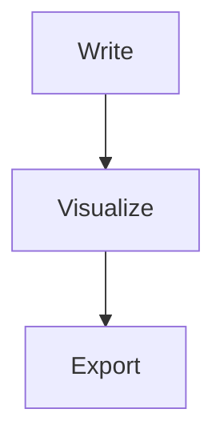

# MDJ Studio
### Markdown Jot Studio
> **Read. Write. Expand.**

[](https://electronjs.org/)
[](https://react.dev/)
[](https://www.typescriptlang.org/)
[](https://mermaid.js.org/)
[](#internationalization-i18n)

**MDJ Studio** is an advanced desktop and web environment designed for writing CommonMark & GitHub Flavored Markdown, authoring interactive Mermaid 11 diagrams, and organizing personal or technical knowledge using native **MDJ 1.2** directives.

---

## 🌟 Key Features

### 0. Live Reader (Default Mode)
Write directly on the rendered result, not on raw Markdown.
- **Visual (Live):** Click any heading, paragraph, list or quote and type in place. Changes are converted back to clean Markdown automatically.
- **Markdown:** Raw source editor with live Mermaid diagram previews below.
- **Hybrid:** Markdown source and rendered result side by side.
- **Inline Mermaid editing:** Each diagram has an *Edit Diagram* drawer with instant re-render.
- **Preserved syntax:** Mermaid blocks, MDJ directives, protected blocks and front-matter survive visual editing intact.
- **Default theme:** Nord Midnight.

### 1. Multi-Language Engine (i18n)
- **Primary Language:** English (`en`, default)
- **Supported Languages:** Spanish (`es`), Portuguese (`pt`)
- **Realtime Switching:** Instant live update across the entire UI (Header, Ribbon, Sidebar, Modals, Status Bar, Find/Replace, and Mermaid viewer) without page reloads.
- **Native Electron Menu Synchronization:** Application menu items (`File`/`Archivo`/`Arquivo`, `Edit`/`Edición`/`Editar`, `View`/`Ver`/`Exibir`) update dynamically via IPC without restarting.

### 2. Office-Style Contextual Ribbon Toolbar
- **Two Contextual Tabs:** `Home` (Text, Headings, Paragraphs, Insert, Directives, MDJ Colors, Find/Replace) and `View` (Panels, Editor/Split/Reader modes, Sync Scroll).
- **Quick Access Toolbar (QAT):** Fast one-click access to library toggle, Undo/Redo, Save, and Find.

### 3. Native Markdown Jot (MDJ 1.2) Directives
- **Hierarchical Front-Matter:** YAML metadata envelope with toggleable reader view.
- **Semantic Highlights:** Official 7-color palette (Red, Orange, Yellow, Green, Blue, Purple, Gray) for both inline and block-level emphasis (`--color` and `--highlight`).
- **Collapsible Sections:** Interactive `--collapse "Title"` blocks with smooth toggle states.
- **Encrypted Blocks (`--protect`):** Zero-knowledge client-side encryption using **AES-256-GCM** with PBKDF2 key derivation (100,000 iterations). Protected content is never exposed in exports or disk plaintexts.

### 4. Mermaid 11 Diagramming Suite
- Flowcharts, Sequence Diagrams, Gantt Charts, Class Diagrams, Mindmaps, and Architecture Diagrams.
- **Interactive Canvas:** Zoom in/out, pan, reset zoom, export to clean SVG or high-resolution PNG.
- **Auto-Healing Engine:** Automatic normalization of architecture diagram arrows and strict syntax handling.

### 5. Document Library & Tree Management
- Nested folders up to 32 levels deep.
- Configurable document tree display formats:
  - *Title & Filename (Recommended)*
  - *Title Only*
  - *Filename Only*
- Realtime search and filtering across titles, filenames, and front-matter tags.
- Full local disk synchronization when running in Electron desktop mode.

### 6. Search & Replace Engine
- Quick Find & Replace bar with case sensitivity (`Alt+C`), whole word (`Alt+W`), and scoped searches (current document vs entire library).
- Keyboard shortcuts: `Ctrl+F` (Find), `Ctrl+H` (Replace), `F3` / `Shift+F3` (Next / Previous match).

### 7. Curated Visual Themes
- **Dark Fintech (Obsidian):** Deep violet-tinted dark mode with frosted glassmorphism.
- **White Modern (Clean):** Crisp high-contrast light theme.
- **Nord Midnight:** Polar night blue dark theme.
- **Sepia Editorial:** Warm paper-inspired reading experience.
- **Cyberpunk Neon:** High-energy neon accents on dark backdrop.
- **System Default:** Automatically matches OS light/dark preferences.

---

## 🚀 Getting Started

### Prerequisites
- [Node.js](https://nodejs.org/) (v18.0 or later recommended)
- `npm` (v9.0 or later)

### Installation
```bash
# Clone the repository
git clone https://github.com/mjalaf/MDJ-Studio.git
cd MDJ-Studio

# Install dependencies
npm install
```

### Running Locally

#### Development (Electron Desktop App)
```bash
npm run electron:dev
```
*This launches both the Vite local development server (`http://localhost:5173`) and the Electron desktop application with Hot Module Replacement (HMR) enabled.*

#### Development (Web Browser Only)
```bash
npm run dev
```

#### Production Build
```bash
# Build React web application bundle
npm run build

# Compile Electron main & preload scripts
npm run electron:build-ts

# Package standalone desktop executables (Windows / macOS / Linux)
npm run electron:build
```

---

## 🧩 MDJ Syntax Cheat Sheet

````markdown
---
title: My Document
tags: [notes, mdj]
mdj:
  version: "1.2"
---

Inline: :color[important]{red} and :highlight[key idea]{yellow}

--color {"color":"purple"}
A block rendered with the purple palette color.
--end

--highlight {"color":"green"}
A highlighted block.
--end

--collapse "Click to expand"
Hidden details, including lists, code and images.
--end


````

**Palette tokens:** `red`, `orange`, `yellow`, `green`, `blue`, `purple`, `gray`.

Encrypted blocks (`--protect`) are created from the Ribbon (*Directives → Protect*) and unlocked with a password inside the reader.

---

## 📤 Export
- **PDF:** Publication-ready output from the rendered view.
- **HTML:** Standalone, self-contained file (no external dependencies).
- Protected blocks are never exported in plaintext.

---

## 🛠️ Tech Stack
| Layer | Technology |
| :--- | :--- |
| Desktop shell | Electron |
| UI | React 19 + TypeScript |
| Bundler | Vite |
| Markdown → HTML | `marked` |
| HTML → Markdown | `turndown` (visual editing) |
| Diagrams | Mermaid 11 |
| PDF export | `html2pdf.js` |
| Icons | `lucide-react` |

---

## 🗂️ Project Structure
```text
MDJ-Studio/
├── electron/          # Main process & preload (IPC, native menu, dialogs)
├── src/
│   ├── components/    # Header, Ribbon, LiveReader, Editor, Sidebar, modals
│   ├── core/          # Front-matter, MDJ directives, crypto, history, find/replace, htmlToMarkdown
│   ├── services/      # File, library and PDF services
│   ├── i18n/          # EN / ES / PT translations
│   └── types/         # Shared TypeScript types
├── public/            # Static assets and icons
└── build/             # Packaging resources (app icon)
```

---

## 💾 Data & Privacy
- The library is stored locally (`localStorage`) and on disk through native Save/Open dialogs.
- Encryption uses **AES-256-GCM** with **PBKDF2** key derivation. Passwords are never stored.
- No telemetry and no network calls for document content.

---

## 🩺 Troubleshooting
| Problem | Solution |
| :--- | :--- |
| Electron changes not applied | Restart `npm run electron:dev`; changes in `electron/` are not hot-reloaded. |
| Cannot type after a native dialog (Windows) | Fixed by refocusing the window after Save/Open; update to the latest version. |
| Diagram shows a syntax error | Open the *Edit Diagram* drawer or Markdown mode and check the Mermaid code. |
| Blank window in production build | Run `npm run build` before `npm run electron:build-ts`. |

---

## 🤝 Contributing
1. Fork the repository and create a branch: `git checkout -b feature/my-feature`.
2. Run `npm run build` to confirm everything type-checks.
3. Open a Pull Request describing the change.

Bug reports: [GitHub Issues](https://github.com/mjalaf/MDJ-Studio/issues).

---

## ⌨️ Useful Keyboard Shortcuts

| Shortcut | Action |
| :--- | :--- |
| `Ctrl + S` | Save current document |
| `Ctrl + N` | Create new document |
| `Ctrl + O` | Open file from disk |
| `Ctrl + B` | Toggle Library Sidebar / Bold text in editor |
| `Ctrl + I` | Italic text |
| `Ctrl + F` | Open Find & Replace Bar |
| `Ctrl + H` | Open Replace mode |
| `Ctrl + Z` | Undo |
| `Ctrl + Y` | Redo |
| `Ctrl + ,` | Open Preferences & Settings |

---

## 📄 License
MIT License. Created by Martin Jalaf.
