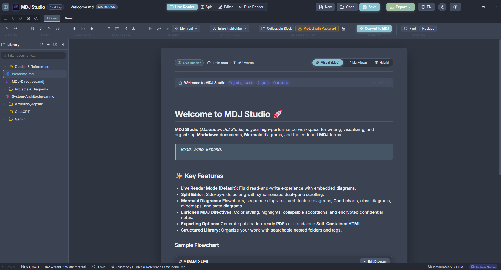
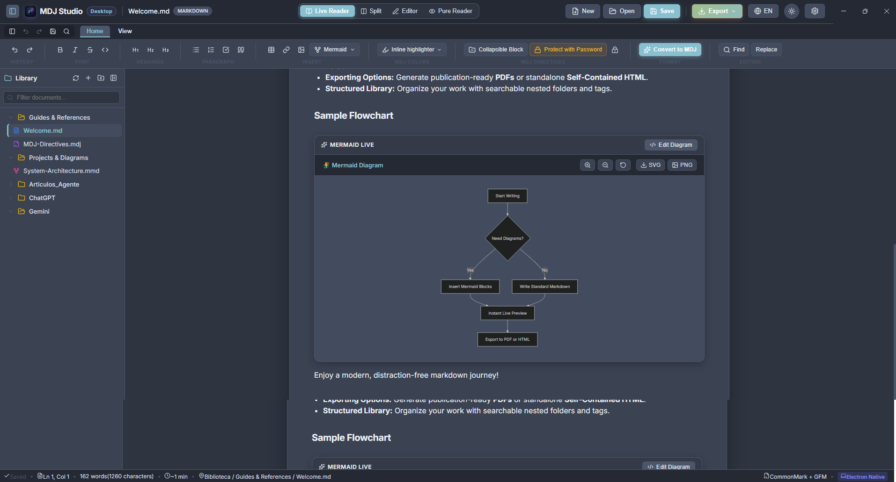
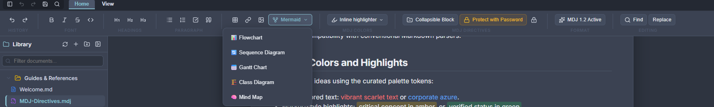
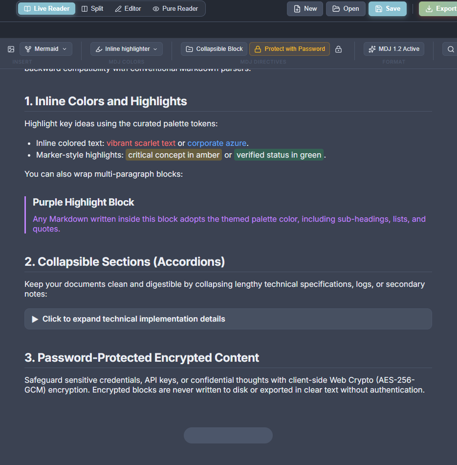
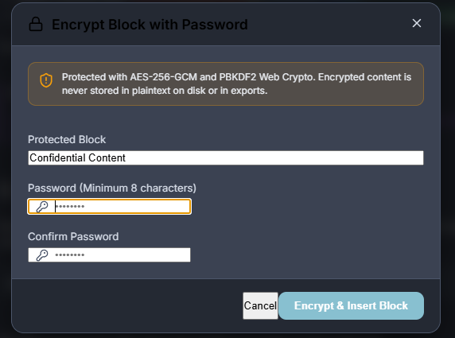
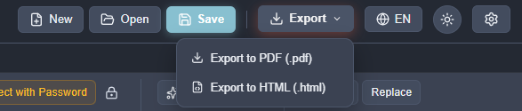
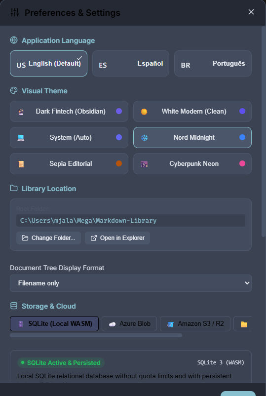
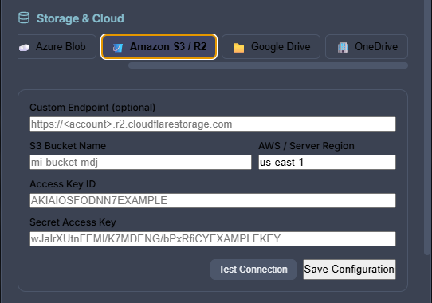
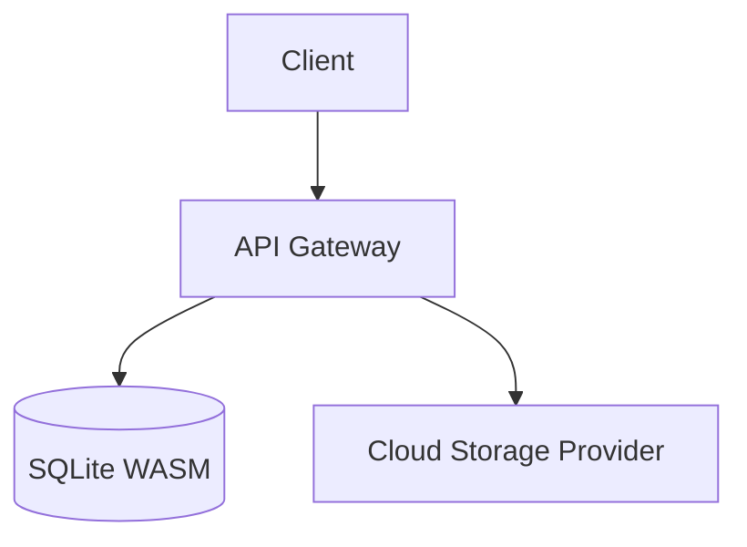

# MDJ Studio
### Markdown Jot Studio
> **Read. Write. Expand.**

[](https://electronjs.org/)
[](https://react.dev/)
[](https://www.typescriptlang.org/)
[](https://mermaid.js.org/)
[](https://sqlite.org/)
[](#-multi-language-engine-i18n)
[](LICENSE)

**MDJ Studio** is an advanced desktop and web environment crafted for writing CommonMark & GitHub Flavored Markdown, authoring interactive Mermaid 11 diagrams, securing sensitive content with client-side zero-knowledge encryption, and organizing technical knowledge using native **MDJ 1.2** directives.

---

## 📸 Visual Overview


*Full workspace overview in Electron: featuring the Microsoft Office-style Ribbon toolbar, nested document library tree, visual live reader, and synchronized status bar.*

---

## 🌟 Key Features & Visual Walkthrough

### 1. Unified Desktop & Web Solution
- **Visual Live Reader (Default):** Edit formatted documents directly in-place with instant round-trip conversion back to clean Markdown.
- **Raw Markdown Editor:** High-performance code editor with live syntax highlighting and code folding.
- **Split Hybrid View:** Synchronized side-by-side editing and rendering.
- **Office-Style Contextual Ribbon:** Structured `Home` and `View` tabs plus a Quick Access Toolbar (QAT) for rapid access to Save, Undo/Redo, and Search.

---

### 2. Interactive Mermaid 11 Diagramming Suite
Full support for Flowcharts, Sequence Diagrams, Gantt Charts, Mindmaps, Class Diagrams, and Architecture Diagrams.


*Full workspace showcasing live, high-fidelity Mermaid 11 diagram rendering.*


*Dedicated diagram toolbar featuring Zoom In/Out, Reset View, Pan, source code toggle, and export to SVG / PNG.*

- **Interactive Canvas:** Zoom, pan, and inspect complex technical diagrams seamlessly.
- **Export Formats:** Export diagrams directly as high-resolution PNG or clean SVG vector graphics.
- **Auto-Healing Engine:** Automatic syntax normalization for Mermaid architecture diagram arrows and strict formatting rules.
- **Inline Editing Drawer:** Quick diagram drawer allowing instant source modifications with live re-render.

---

### 3. Native MDJ 1.2 Directives & Editor Capabilities
Take Markdown further with structured MDJ 1.2 directives designed for documentation and technical jots.


*Editor view highlighting collapsible folding sections, 7-color semantic highlights, and AES-256-GCM protected blocks.*

- **Collapsible Sections (`--collapse`):** Create expandable blocks with custom titles to organize deep documentation without clutter.
- **Semantic Color & Highlight Palettes:** Official 7-color palette (`red`, `orange`, `yellow`, `green`, `blue`, `purple`, `gray`) available for both inline highlights (`:color[]{}` / `:highlight[]{}`) and container blocks (`--color` / `--highlight`).
- **YAML Front-Matter Envelope:** Clean document metadata with interactive title and tag badges.

---

### 4. Zero-Knowledge Client-Side Encryption
Protect sensitive credentials, tokens, or private notes directly within your documents.


*Password encryption popup securing designated blocks using AES-256-GCM.*

- **AES-256-GCM Cryptography:** Industry-standard encryption using PBKDF2 key derivation with 100,000 iterations.
- **Zero-Knowledge Security:** Plaintext content is never written to disk or sent over any network. Passwords are never stored.
- **Interactive Unlock:** Protected blocks (`--protect`) render as secure cards inside the reader, unlocked on demand with a password.

---

### 5. Publication-Ready Export (PDF & HTML)
Share your knowledge with colleagues or export standalone artifacts with a single click.


*Export dropdown providing one-click standalone HTML and publication-ready PDF export.*

- **PDF Export:** Generates clean, publication-ready PDFs from the rendered view using `html2pdf.js`.
- **Standalone HTML Export:** Produces self-contained HTML files with embedded styling and zero external runtime dependencies.
- **Confidentiality by Design:** Protected blocks are never leaked in plaintext during export.

---

### 6. Preferences & Visual Customization
Tailor MDJ Studio to match your workflow and aesthetic preferences.


*Preferences & Settings dialog: Language selection, curated themes, library root directory, and tree display options.*

- **Multi-Language Engine (i18n):**
  - **English** (`en`, default)
  - **Spanish** (`es`)
  - **Portuguese** (`pt`)
  - Live UI switching without application reloads. Dynamic IPC synchronization updates the native Electron menu bar (`File`, `Edit`, `View`) in real time.
- **Curated Visual Themes:**
  - 🔮 **Dark Fintech (Obsidian):** Deep violet dark mode with glassmorphism.
  - ☀️ **White Modern (Clean):** High-contrast, pristine light theme.
  - ❄️ **Nord Midnight:** Polar night blue dark palette.
  - 📜 **Sepia Editorial:** Warm, paper-inspired reading experience.
  - 🌆 **Cyberpunk Neon:** High-contrast neon accents.
  - 💻 **System Auto:** Automatically syncs with your operating system's light/dark mode.
- **Document Tree Display Modes:** Choose between *Title & Filename*, *Title Only*, or *Filename Only*.

---

### 7. Multi-Provider Cloud & Local Storage Architecture
Seamlessly store and synchronize your documents across local storage and leading enterprise cloud providers.


*Comprehensive storage settings supporting SQLite WASM, Azure Blob, Amazon S3 / R2, Google Drive, and Microsoft OneDrive.*

| Storage Provider | Type | Capabilities |
| :--- | :--- | :--- |
| **SQLite 3 (WASM)** | Local In-Browser / Desktop | Fully offline relational database, live statistics, export/import `.sqlite` database files. |
| **Local File System** | Desktop (Electron) | Direct disk synchronization, native folder picker, open in Windows Explorer / Finder. |
| **Azure Blob Storage** | Cloud Object Storage | Account name, container name, and secure SAS token configuration with connection test. |
| **Amazon S3 / Cloudflare R2** | Cloud Object Storage | S3-compatible endpoints, access keys, bucket selection, and custom region routing. |
| **Google Drive** | Cloud Drive | Seamless sync with Google Workspace / Drive storage. |
| **Microsoft OneDrive** | Cloud Drive | Direct synchronization with OneDrive cloud folders. |

---

## 🧩 MDJ 1.2 Syntax Cheat Sheet

````markdown
---
title: System Architecture & Notes
tags: [dev, cloud, architecture]
mdj:
  version: "1.2"
---

# Project Overview

Inline emphasis: :color[critical notice]{red} and :highlight[important step]{yellow}.

--color {"color":"purple"}
This block is styled with the purple MDJ palette.
--end

--highlight {"color":"green"}
This block is highlighted with the green MDJ palette.
--end

--collapse "Expand Database Schema Details"
Here are hidden details, code blocks, or extensive logs that remain tucked away until toggled.
--end


````

**Supported Color Tokens:** `red`, `orange`, `yellow`, `green`, `blue`, `purple`, `gray`.

---

## 🛠️ Technology Stack

| Component | Technology | Description |
| :--- | :--- | :--- |
| **Shell** | [Electron 44](https://electronjs.org/) | Cross-platform desktop runtime (Windows, macOS, Linux) |
| **Frontend UI** | [React 19](https://react.dev/) + [TypeScript 6](https://www.typescriptlang.org/) | Component-driven reactive UI architecture |
| **Build Tool** | [Vite 8](https://vitejs.dev/) | Lightning-fast development server & bundler |
| **Diagrams** | [Mermaid 11](https://mermaid.js.org/) | Diagramming and charting engine with auto-healing |
| **Local Database** | [sql.js / SQLite 3 WASM](https://sql.js.org/) | WebAssembly-powered embedded relational storage |
| **Markdown Parser** | [Marked](https://marked.js.org/) | High-speed CommonMark & GFM compiler |
| **HTML to Markdown** | [Turndown](https://github.com/mixmark-io/turndown) | Bidirectional visual editor conversion engine |
| **PDF Generation** | [html2pdf.js](https://ekoopmans.github.io/html2pdf.js/) | Client-side vector & HTML-to-PDF rendering |
| **Iconography** | [Lucide React](https://lucide.dev/) | Consistent, clean modern iconography |

---

## 🗂️ Project Structure

```text
MDJ-Studio/
├── docs/
│   └── images/              # Application screenshots (View-01 through View-08)
├── electron/                # Electron main process, preload, and native menus
│   ├── main.cjs
│   └── preload.cjs
├── src/
│   ├── components/          # React components (Ribbon, LiveReader, MermaidViewer, SettingsModal, etc.)
│   ├── core/                # Directives parser, AES-256 crypto, front-matter, and conversion
│   ├── services/
│   │   ├── storage/         # SQLite WASM, StorageManager, and Cloud Providers (S3, Azure, GDrive, OneDrive)
│   │   ├── fileService.ts   # Electron filesystem integration
│   │   ├── libraryService.ts# Library indexing & document state
│   │   └── pdfService.ts    # PDF export engine
│   ├── i18n/                # Localization dictionaries (en, es, pt)
│   ├── types/               # TypeScript definitions
│   └── index.css            # Core design system & theme definitions
├── public/                  # Static assets and icons
└── package.json
```

---

## 🚀 Getting Started

### Prerequisites
- [Node.js](https://nodejs.org/) (v18.0 or later recommended)
- `npm` (v9.0 or later)

### Installation
```bash
# Clone the repository
git clone https://github.com/mjalaf/MDJ-Studio.git
cd MDJ-Studio

# Install all dependencies
npm install
```

### Running in Development

#### Desktop App (Electron + Vite HMR)
```bash
npm run electron:dev
```
*Starts Vite dev server on `http://localhost:5173` and launches the Electron desktop shell with Hot Module Replacement.*

#### Web Browser Only
```bash
npm run dev
```

### Building for Production

```bash
# 1. Build the React web application bundle
npm run build

# 2. Compile Electron TypeScript scripts
npm run electron:build-ts

# 3. Package standalone desktop executables (Windows / macOS / Linux)
npm run electron:build
```
*Generated installers and executables are output to the `release/` directory.*

---

## ⌨️ Keyboard Shortcuts

| Shortcut | Action |
| :--- | :--- |
| `Ctrl + S` | Save current document |
| `Ctrl + N` | Create a new document |
| `Ctrl + O` | Open file from local disk |
| `Ctrl + B` | Toggle Library Sidebar / Bold text in editor |
| `Ctrl + I` | Italic text |
| `Ctrl + F` | Open Find & Replace Bar |
| `Ctrl + H` | Open Replace mode |
| `F3` / `Shift + F3` | Next / Previous search match |
| `Ctrl + Z` | Undo change |
| `Ctrl + Y` | Redo change |
| `Ctrl + ,` | Open Preferences & Settings |

---

## 🔒 Data Privacy & Security

- **Local-First Architecture:** Documents are stored in your local directory or local SQLite WASM database by default.
- **Zero-Knowledge Encryption:** Content enclosed in `--protect` directives is encrypted using **AES-256-GCM** with **PBKDF2** (100,000 iterations). Keys are derived strictly in memory from user passwords and never written to disk or transmitted over the wire.
- **No Telemetry:** MDJ Studio does not collect analytics or make external telemetry calls.

---

## 🤝 Contributing

Contributions, feedback, and suggestions are welcome!

1. Fork the repository and create your feature branch:
   ```bash
   git checkout -b feature/amazing-feature
   ```
2. Validate changes and test type compilation:
   ```bash
   npm run build
   ```
3. Commit your changes and push:
   ```bash
   git commit -m "Add amazing feature"
   git push origin feature/amazing-feature
   ```
4. Open a Pull Request on GitHub.

Issues & Feature Requests: [GitHub Issues](https://github.com/mjalaf/MDJ-Studio/issues)

---

## 📄 License

This project is licensed under the **MIT License** — see the [LICENSE](LICENSE) file for details.  
Created by **Martin Jalaf**.
